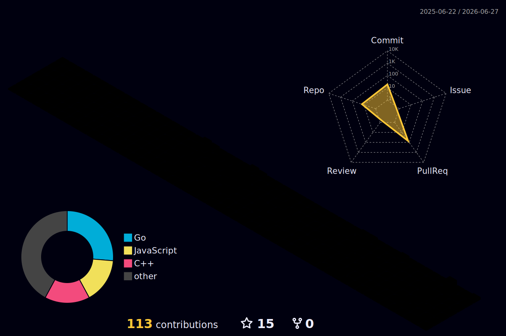

<div align="center">


<br/>

### 🔩 Hardware & Systems Engineer · Embedded Systems & IoT · Reverse Engineering
> *Building things at the intersection of software, silicon, and solder.*

<br/>

[](https://yourdomain.dev)
[](https://t.me/Ri4ards2006)
[](https://instagram.com/mr_ri4i)

</div>

---

## ⚙️ Engineering Focus

```
┌─────────────────────────────────────────────────────────────────┐
│  EMBEDDED SYSTEMS    │  FPGA / VHDL         │  REVERSE ENG.     │
│  Arduino · ESP32     │  Digital Logic Design │  Binary Analysis  │
│  STM32 · AVR · MCU   │  Hardware Description │  Firmware RE      │
├─────────────────────────────────────────────────────────────────┤
│  IoT & PROTOCOLS     │  ELECTRICAL ENG.      │  SYSTEMS & INFRA  │
│  MQTT · I²C · SPI    │  PCB · Oscilloscope   │  Linux · Docker   │
│  UART · CAN · RF     │  Soldering · EE Theory│  Proxmox · Nets   │
└─────────────────────────────────────────────────────────────────┘
```

---

## 🛠️ Tech Stack

**Low-Level & Hardware**


**Systems & Tooling**


**Infrastructure**


**Logic & Web**


---

## 🔬 The Lab

<table border="0">
  <tr>
    <td width="50%" valign="top" align="center">
      
      <br/><b>Main Workstation</b>
      <br/><sub>Arch Linux · Custom Rice · Neovim · Binary Analysis</sub>
    </td>
    <td width="50%" valign="top" align="center">
      
      <br/><b>Hardware Lab</b>
      <br/><sub>Soldering Station · Oscilloscope · MCU Prototyping · PCB</sub>
    </td>
  </tr>
</table>

---

## 🚀 Engineering Roadmap

| Project | Core Tech | Domain | Status |
| :--- | :--- | :--- | :--- |
| **[Traffic Light](https://github.com/Ri4ards2006/Traffic-Light)** | `C` · `Arduino` | Embedded | ✅ Done |
| **[WeatherStation 2.0](https://github.com/Ri4ards2006/Weather_Station2.0)** | `C++` · `IoT` | IoT / Sensors | 🔄 Active |
| **Circuit Design** | `KiCad` · `EE` | Electrical Eng. | 📐 Planning |
| **Go Networking Tool** | `Go` · `Binaries` | Systems / RE | 🔍 Researching |
| **FPGA Project** | `VHDL` · `Xilinx` | Digital Logic | 💡 Planned |
| **Firmware RE Lab** | `Ghidra` · `GDB` | Reverse Eng. | 💡 Planned |

---

## 📊 Stats




---

## 📡 Connect

[](https://yourdomain.dev)
[](https://t.me/Ri4ards2006)
[](https://instagram.com/mr_ri4i)
[](#)
[](#)
[](#)
[](https://linktr.ee/RichardZuikov)
[](https://www.paypal.com/paypalme/RichardZuikov)

---

<div align="center">

</div>     
   